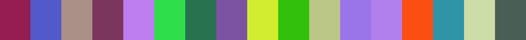
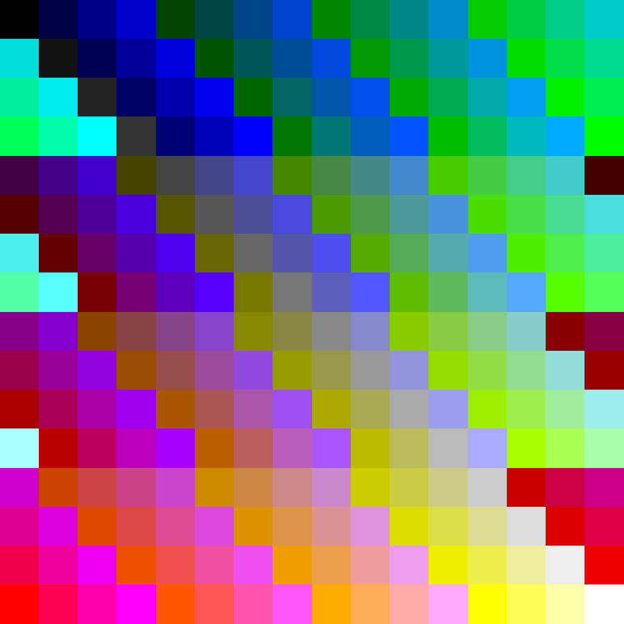
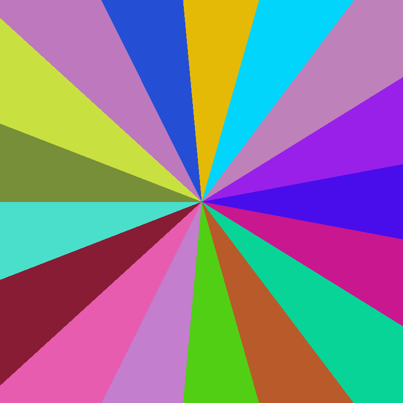
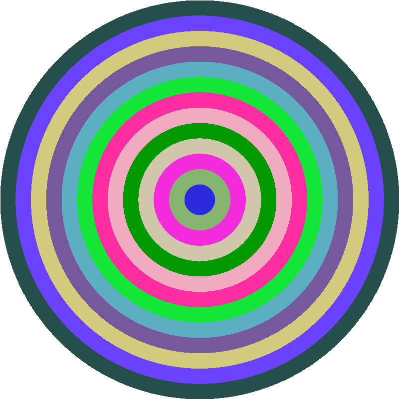

# imgcolors

[](https://github.com/mazznoer/imgcolors/releases/latest)
[](https://pkg.go.dev/github.com/mazznoer/imgcolors?tab=doc)
[](https://travis-ci.org/mazznoer/imgcolors)
[](https://github.com/mazznoer/imgcolors/actions)
[](https://goreportcard.com/report/github.com/mazznoer/imgcolors)
[](https://codecov.io/gh/mazznoer/imgcolors)

Create image from colors

## Examples

### Horizontal
```go
package main

import (
    "image/color"
    "math/rand"

    "github.com/mazznoer/imgcolors"
)

func main() {
    colors := make([]color.Color, 17)
    for i := range colors {
        colors[i] = randColor()
    }
    img := imgcolors.Horizontal(colors, 900, 70)
    // ...
}

func rand255() uint8 {
    return uint8(rand.Intn(255))
}

func randColor() color.Color {
    return color.RGBA{rand255(), rand255(), rand255(), 255}
}
```


[Try it online](https://play.golang.org/p/7zaL_OQ4Gbf)

### Vertical
```go
colors := make([]color.Color, 10)

for i := range colors {
    colors[i] = randColor()
}
img := imgcolors.Vertical(colors, 45, 45*10)
```


### Square
```go
import "image/color/palette"

img := imgcolors.Square(palette.Plan9, 900)
```


### Conic
```go
colors := make([]color.Color, 17)

for i := range colors {
    colors[i] = randColor()
}
img := imgcolors.Conic(colors, 800, 800)
```


### Radial
```go
colors := make([]color.Color, 13)

for i := range colors {
    colors[i] = randColor()
}
img := imgcolors.Radial(colors, 800, 800)
```

